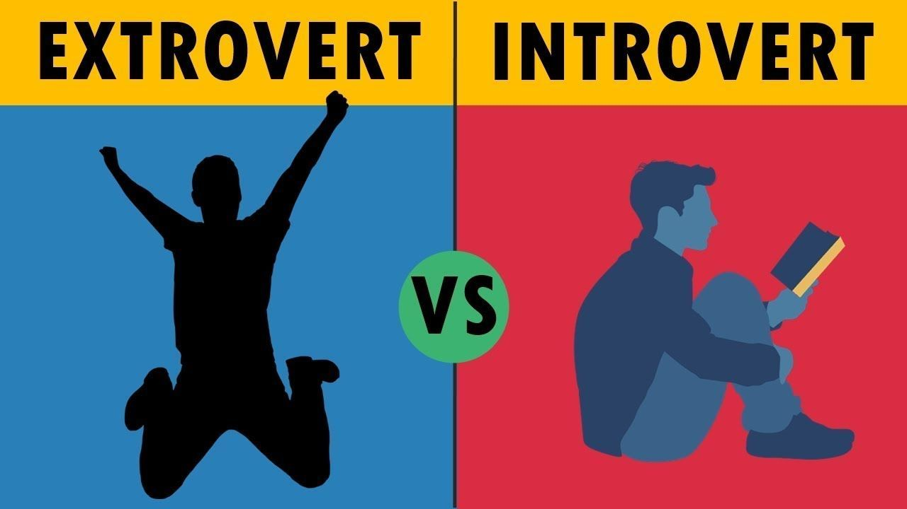

# 🧠 Personality Prediction System



---

## 📌 Project Overview

This project predicts whether an individual is an **Introvert or Extrovert** using machine learning classification models based on their behavioral, social, and lifestyle patterns.

The system analyzes factors such as **time spent alone, stage fear, social event attendance, going outside, social exhaustion, friends circle size, and social media posting frequency** to predict personality type.

An interactive **Streamlit web application** allows users to enter their behavioral information and receive an **instant personality prediction**.

> 🔧 **Tools Used:** Python, Machine Learning, Streamlit

---

## 📁 Dataset Information

* **Records:** 2,900
* **Target Variable:** Personality
* **Key Columns:**

  * **Time spent Alone** — Time an individual prefers to spend alone
  * **Stage fear** — Whether the individual experiences fear during public speaking or stage activities
  * **Social event attendance** — Frequency or duration of participation in social events
  * **Going outside** — Time spent outside the home
  * **Drained after socializing** — Whether the individual feels tired after social interactions
  * **Friends circle size** — Approximate size of the individual's social circle
  * **Post frequency** — Frequency of posting on social media
  * **Personality** — Target variable representing Introvert or Extrovert

---

## 🎯 Objectives

* Predict whether a person is **Introvert or Extrovert**
* Identify behavioral and social factors associated with personality
* Perform exploratory data analysis to understand patterns in the dataset
* Compare multiple machine learning classification models
* Improve model performance through hyperparameter optimization
* Evaluate models using multiple classification metrics
* Deploy the final prediction system using Streamlit

---

## 📊 Analysis Summary

* **EDA:** Distribution analysis, relationship analysis, and visualization of behavioral patterns
* **Feature Engineering:** Label Encoding, One-Hot Encoding, and StandardScaler
* **Model Training:** Multiple classification algorithms were trained and compared
* **Hyperparameter Optimization:** Grid Search, Random Search, and Bayesian Optimization
* **Validation:** Cross-validation was used to evaluate model performance
* **Insights:** Introverts generally show higher time spent alone, greater stage fear, lower social event attendance, smaller friend circles, and lower social media posting frequency, while extroverts generally show opposite behavioral patterns.

---

## 🤖 Models Used

| Category                  | Techniques                                                                |
| ------------------------- | ------------------------------------------------------------------------- |
| **Preprocessing**         | LabelEncoder, OneHotEncoder, StandardScaler                               |
| **Classification Models** | Logistic Regression, Decision Tree, Random Forest, SVC, KNN               |
| **Evaluation**            | Confusion Matrix, Classification Report, Accuracy, AUC-ROC Curve          |
| **Validation & Tuning**   | Cross-Validation, GridSearchCV, RandomizedSearchCV, Bayesian Optimization |
| **Deployment**            | Streamlit                                                                 |

---

## 📈 Key Insights

* **Extroverts** generally spend less time alone and participate more actively in social events.
* **Introverts** tend to spend more time alone and are more likely to feel drained after socializing.
* **Extroverts** generally have larger friends circles compared to introverts.
* **Introverts** show lower social media posting frequency.
* **Stage fear** is more commonly observed among introverts in this dataset.
* Behavioral and social characteristics show a **strong relationship with personality type**.

---

## 🚀 Streamlit Deployment

The Streamlit web application allows users to:

* Enter behavioral and social information
* Provide details such as time spent alone, stage fear, and social event attendance
* Enter information about going outside, social exhaustion, friends circle size, and post frequency
* Get an instant **Introvert / Extrovert** prediction
* View the prediction through a simple and user-friendly interface

---

## 🖥️ Deployment Preview


---

## 🛠️ How to Run Locally

### 1. Clone the Repository

```bash
git clone https://github.com/Sivaprasad-creator/Personality-Prediction.git
cd Personality-Prediction
```

### 2. Create and Activate Virtual Environment *(Optional but Recommended)*

**On Windows:**

```bash
python -m venv venv
venv\Scripts\activate
```

**On macOS/Linux:**

```bash
python3 -m venv venv
source venv/bin/activate
```

### 3. Install Dependencies

```bash
pip install -r requirements.txt
```

### 4. Run the Streamlit App

```bash
streamlit run app.py
```

---

## 📬 Author Info

**Sivaprasad T.R**
📧 Email: [sivaprasadtrwork@gmail.com](mailto:sivaprasadtrwork@gmail.com)
🔗 [LinkedIn](https://www.linkedin.com/in/sivaprasad-t-r)
💻 [GitHub](https://github.com/Sivaprasad-creator)

---
